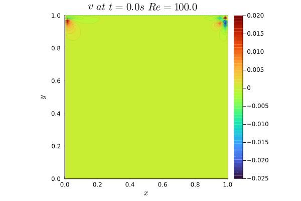
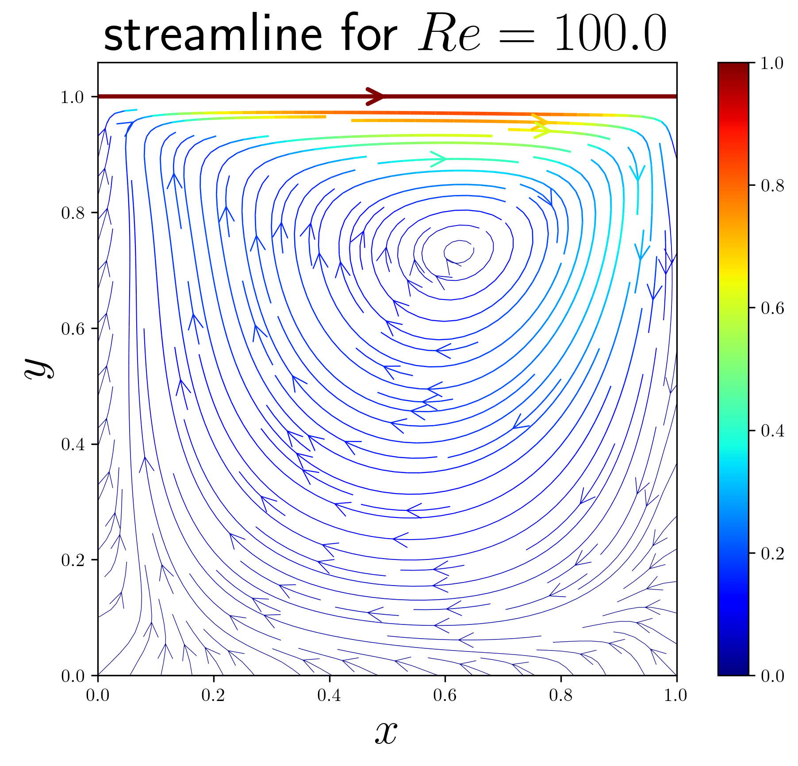
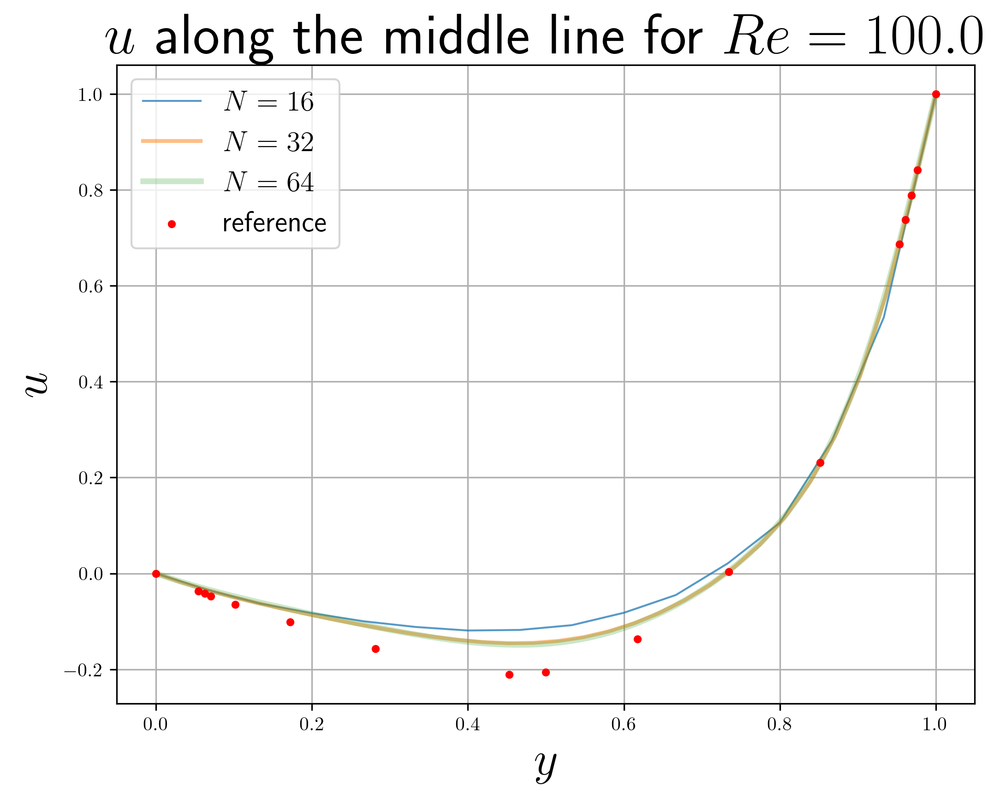
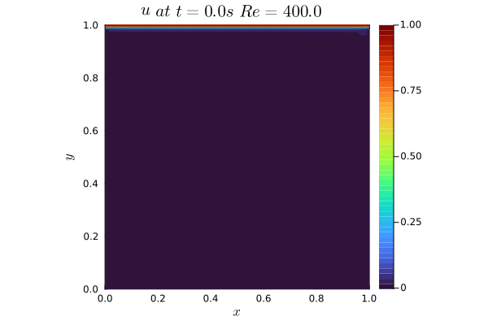
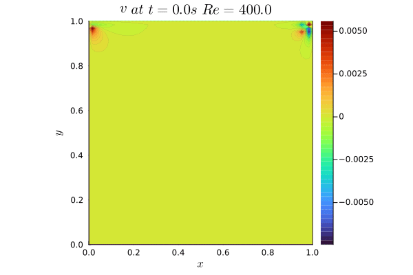
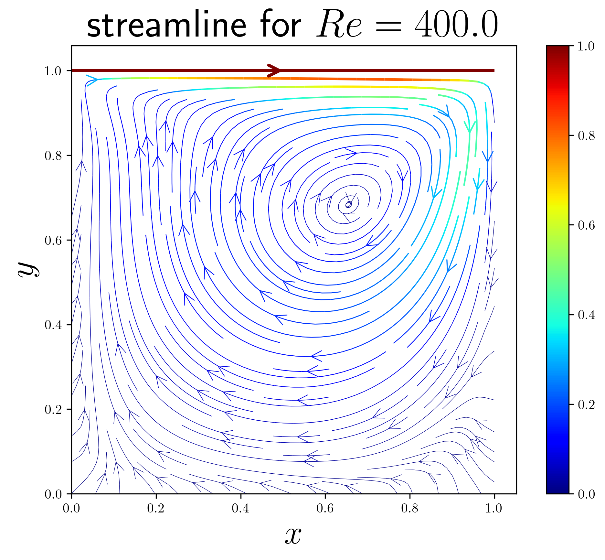
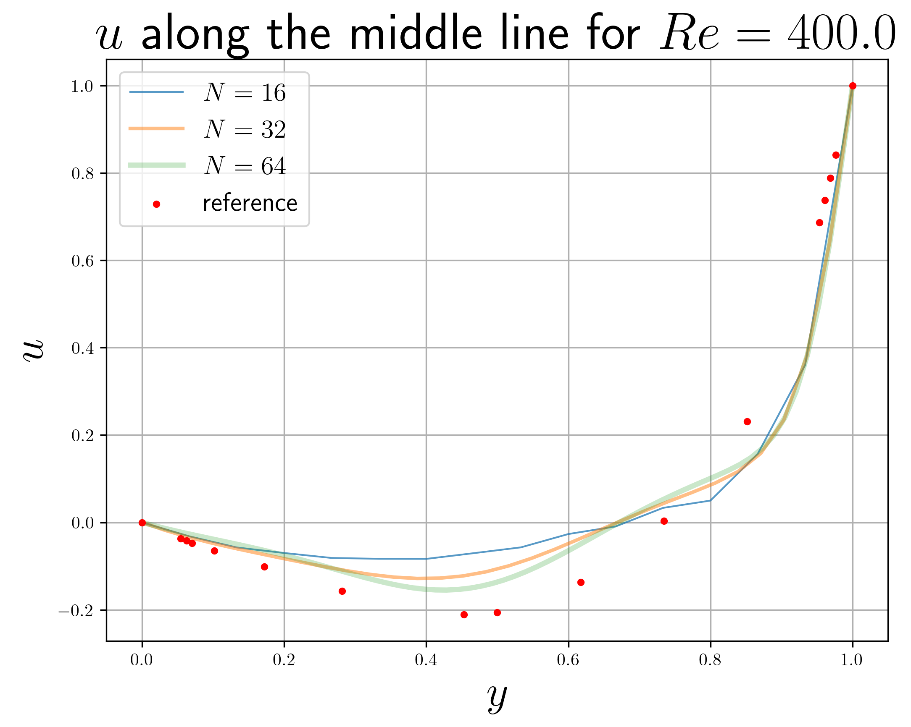

# FFD_LidDrivenCavity

A repository containing FFD code to solve lid-driven cavity using FFD method.

The code was written in December 2022 when I studying FFD. Now I try to make it more readable and understandable.

# Requirements

- language: Julia
- Pacakges:
    - `Plots`
    - `PyPlot`
    - `DelimitedFiles`
    - `CSV`
    - `DataFrames`

# Brief Results

## $Re=100$

<figure>

gif of the contour for $u$ and $v$

</figure

<figure>

streaml line and $u$ at the middle of the cavity

</figure>

## $Re=400$

<figure>

gif of the contour for $u$ and $v$

</figure

<figure>

stream line and $u$ at the middle of the cavity

</figure>

# Reference

- [Fast Fluid Dynamics-people.sc.fsu.edu](https://people.sc.fsu.edu/~lb13f/projects/finite_difference/fast_fluid_dynamics.php#:~:text=Fast%20Fluid%20Dynamics%20%28FFD%29%20is%20a%20technique%20for,extended%20to%20wind%20load%20optimization%20among%20other%20applications.)
- [Github-Balavarun5/fast_fluid_dynamics](https://github.com/Balavarun5/fast_fluid_dynamics)
- [Nvidia-FFD](https://developer.nvidia.com/gpugems/gpugems/part-vi-beyond-triangles/chapter-38-fast-fluid-dynamics-simulation-gpu)
- [University pf Colorado Boulder-FFD](https://www.colorado.edu/lab/sbs/fastfluiddynamics)